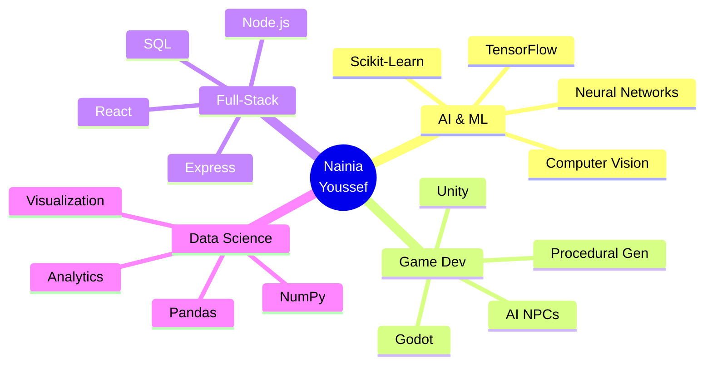

<div align="center">


</div>

<div align="center">
  
[](https://git.io/typing-svg)

<br>


[](https://github.com/NainiaYoussef)
[](https://github.com/NainiaYoussef)

</div>

---


### 👨‍💻 About Me

```python
class Developer:
    def __init__(self):
        self.name = "Nainia Youssef"
        self.role = "AI & Data Science Student"
        self.location = "Morocco 🇲🇦"
        self.age = 20
        self.education = "AI & Data Science"
        self.languages = ["Python", "C", "JavaScript", "GDScript", "SQL"]
        self.passions = ["AI/ML", "Game Development", "Full-Stack Dev"]
        
    def current_focus(self):
        return [
            "🤖 Machine Learning & Neural Networks",
            "🎮 AI-Driven Game Mechanics",
            "🌐 Full-Stack Web Applications",
            "📊 Data Analysis & Visualization"
        ]
    
    def say_hi(self):
        print("Hey there! I build intelligent systems")
        print("and games that think for themselves 🚀")

me = Developer()
me.say_hi()
```

<br clear="right"/>

---

## 🚀 What I'm Up To

<table>
  <tr>
    <td width="50%">
      
### 🔥 Current Focus

- 🎯 Building **AI-powered NPCs** with adaptive behavior
- 🌟 Developing **intelligent web applications**
- 📚 Mastering **Machine Learning algorithms**
- 🎨 Creating **indie games** in Unity & Godot
- 🔬 Exploring **Computer Vision** applications

    </td>
    <td width="50%">
      
### 💡 Learning Journey

- 🧠 Deep Learning with TensorFlow & PyTorch
- 🎮 Advanced Game AI & Procedural Generation
- ☁️ Cloud Computing & DevOps
- 🔐 Cybersecurity fundamentals
- 📱 Mobile App Development

    </td>
  </tr>
</table>

---

## 🛠️ Tech Arsenal

<div align="center">

### Languages & Core Skills


### Frontend Technologies


### Backend & Tools


### AI & Data Science


### Game Development


</div>

---

## 📊 GitHub Analytics

<div align="center">
  
  
</div>

<div align="center">
  
</div>

<div align="center">
  
</div>

---

## 🏆 Achievements & Trophies

<div align="center">
  


</div>

---

## 📈 Contribution Graph

<div align="center">

[](https://github.com/ashutosh00710/github-readme-activity-graph)

</div>

---

## 💻 Most Used Languages (Detailed)

<div align="center">

<!--START_SECTION:waka-->
```text
Python       ████████████░░░░░░░░░  45.2%
JavaScript   ███████░░░░░░░░░░░░░░  25.8%
C            ████░░░░░░░░░░░░░░░░░  12.4%
GDScript     ██░░░░░░░░░░░░░░░░░░░   8.3%
HTML/CSS     ██░░░░░░░░░░░░░░░░░░░   5.1%
SQL          █░░░░░░░░░░░░░░░░░░░░   3.2%
```
<!--END_SECTION:waka-->

</div>

---

## 🎯 Featured Projects

<div align="center">

<table>
<tr>
<td width="50%">

### 🤖 AI Projects
[](https://github.com/NainiaYoussef)

</td>
<td width="50%">

### 🎮 Game Projects
[](https://github.com/NainiaYoussef)

</td>
</tr>
</table>

</div>

---

## 🌟 Random Dev Wisdom

<div align="center">

[](https://github.com/piyushsuthar/github-readme-quotes)

</div>

---

## 🎨 Skills Visualization

<div align="center">



</div>

---

## 🐍 Watch the Snake Eat My Contributions!

<div align="center">

<picture>
  <source media="(prefers-color-scheme: dark)" srcset="https://raw.githubusercontent.com/platane/platane/output/github-contribution-grid-snake-dark.svg">
  <source media="(prefers-color-scheme: light)" srcset="https://raw.githubusercontent.com/platane/platane/output/github-contribution-grid-snake.svg">
  
</picture>

</div>

---

## 🌐 Connect & Collaborate

<div align="center">

[](https://linkedin.com/in/nainia-youssef)
[](https://instagram.com/nainia.youssef)
[](#)
[](mailto:your.email@example.com)

</div>

<div align="center">
  
### 💬 Let's Build Something Amazing Together!

*"In a world of algorithms, be the code that makes a difference."*

<br>


</div>

---

<div align="center">


**⭐ From [NainiaYoussef](https://github.com/NainiaYoussef) with 💜**

*Last Updated: Automatically via GitHub Actions*

</div>
